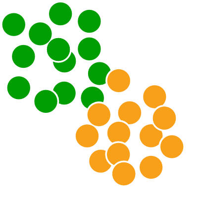

<!-- badges: start -->
[](https://github.com/acorg/Racmacs/actions/workflows/R-CMD-check.yaml)
<!-- badges: end -->



# Racmacs
The Racmacs package provides a toolkit for making antigenic maps from assay data such as HI assays, as described in [Smith et al. 2004](https://doi.org/10.1126/science.1097211).

For an introduction to antigenic cartography, see the article [an introduction to antigenic cartography](https://acorg.github.io/Racmacs/articles/intro-to-antigenic-cartography.html). For a general introduction to using Racmacs to make an antigenic map from titer data see the article [making an antigenic map from titer data](https://acorg.github.io/Racmacs/articles/making-a-map-from-scratch.html). For documentation of the functions available see the [references](https://acorg.github.io/Racmacs/reference/index.html) section.

## Installation instructions
### Install the devtools package
If not already installed, install the `devtools` package, this provides functions to help with installation.
```R
install.packages("devtools")
```

### Install Racmacs
Now you can install Racmacs directly from the latest development source code. In future pre-built binary versions will 
also be included.

```R
# To build from github source
devtools::install_github("acorg/Racmacs")
```

#### Problems compiling on MacOS
When installing Racmacs on a mac os, compilation will most likely fail under the default setup since the necessary libraries that are linked to cannot be found. The recommended solution, which should both solve this problem and speed up the code, is for mac users to follow the instructions below for setting up your environment to use the gcc and associated fortran compiler.

In the future we will try to provide pre-built binary versions of Racmacs for the latest major operating systems and R versions to avoid the need to build the package locally.

#### Building Racmacs to run code in parallel
Racmacs uses [OpenMP](https://www.openmp.org) instructions to specify when code can be run in parallel to increase performance. The resulting speed-up can be significant, but you need to check whether the compiler you use supports OpenMP.

The default compiler on mac systems for example is `clang` which does not support OpenMP and will fail anyway by default because it does not include a fortran compiler by default.

__Installing gcc and a fortran compiler__  
The solution for both OpenMP support and provision of a fortran compiler on a mac system is to follow the guidance from the [R project page for mac](https://mac.r-project.org/tools/) and install the official GNU Fortran binaries from F.X.Coudert found [here](https://github.com/fxcoudert/gfortran-for-macOS/releases).

Note that you have to install the correct version according to your hardware e.g. an intel or M1 mac, and for your correct OS. Also if you have an M1 mac, make sure that you have installed the M1 version of the R installer and not the intel one, otherwise loading the package will fail since R will have been compiled for an intel system and Racmacs for an M1 system.

The easiest method of installation is through finding the appropriate .dmg file which will contain an automatic installer for you rather than the .tar.xz source versions where you will have to deal with installation yourself.

__Changing the default compiler in R__  
Once you have installed your fortran compiler and the packaged gcc compiler you need to change the default compiler in R. To do this you specify it in your local `Makevars` file. This exists in the `.R` folder in your home folder, i.e. `~/.R/Makevars`. It is possible you will have to create the `.R` folder and the `Makevars` text file.

Once done, add the following lines to the `Makevars` file and update the paths to the appropriate path for each of the respective executables, for example:

```
CC=/usr/local/gfortran/bin/gcc
CXX=/usr/local/gfortran/bin/g++
CXX1X=/usr/local/gfortran/bin/g++
CXX11=/usr/local/gfortran/bin/g++
SHLIB_CXXLD=/usr/local/gfortran/bin/g++
FC=/usr/local/gfortran/bin/gfortran
F77=/usr/local/gfortran/bin/gfortran
MAKE=make -j8

SHLIB_OPENMP_CFLAGS=-fopenmp
SHLIB_OPENMP_CXXFLAGS=-fopenmp
SHLIB_OPENMP_FCFLAGS=-fopenmp
SHLIB_OPENMP_FFLAGS=-fopenmp
```

Now when you try and install and build the package from source things should be setup to use g++, with support for OpenMP parallelization now included.

Finally, to check whether your version of Racmacs has been compiled to work in parallel or not you can run the command `Racmacs:::parallel_mode()`, which should return `TRUE`. It's not a problem if it returns `FALSE`, optimization code just won't run in parallel so will take a bit longer.

