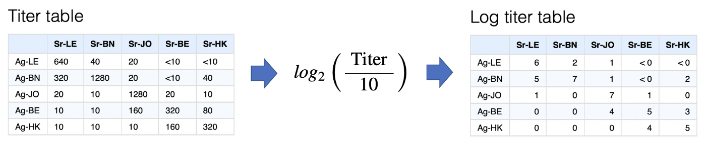

<style>
img {
  width: 100%;
  border: none;
  margin-top: 30px;
  margin-bottom: 30px;
}

figcaption {
  padding-top: 40px;
}

figure::after {
  content: "";
  clear: both;
  display: table;
}

.figure p {
  display: none;
}

blockquote {
  font-size: 15px;
}

</style>

```{r, include = FALSE}
knitr::opts_chunk$set(
  collapse = TRUE,
  comment = "#>"
)
```

```{r setup, include = FALSE}
library(Racmacs)
```

## Introduction
Here we aim to give a brief introduction to antigenic cartography, the steps taken to convert a table of titer data to an antigenic map, the potential advantages of doing so, and the potential drawbacks.

### What is an antigenic map?
Firstly, an antigenic map takes titration data that measures strength of reactivity of a group of antisera (sera where an immunologically naive animal has been infected with a single antigen) against a group of antigens (usually simply different pathogen strains).

The classic example for which cartography was developed was tables of HI titers measuring ferret antiserum reactivity against different influenza strains, but the same approach has also been used for other assays such as the FRA or HINT assays, and other pathogens, such as dengue.

In the actual map itself, different antigens are typically represented as solid circles with straight-line distances between them representative of antigenic similarity, hence antigenically similar strains should appear close to each other on the map, while antigenically distinct strains should appear further apart.

A good example is the first antigenic map of H3N2 evolution published in 2004 and show below, visualising H3N2 influenza evolution since it's emergence in humans in 1968.

<figure>

<figcaption>
__Antigenic map of influenza A (H3N2) virus from 1968 to 2003.__ The relative positions of strains (colored circles) and antisera (uncolored open squares) were adjusted such that the distances between strains and antisera in the map represent the corresponding HI measurements with the least error. Strain color represents the antigenic cluster to which the strain belongs. Clusters were identified by a k-means clustering algorithm and named after the first vaccine-strain in the cluster—two letters refer to the location of isolation (Hong Kong, England, Victoria, Texas, Bangkok, Sichuan, Beijing, Wuhan, Sydney, and Fujian) and two digits refer to year of isolation. The vertical and horizontal axes both represent antigenic distance, and, because only the relative positions of antigens and antisera can be determined, the orientation of the map within these axes is free. The spacing between grid lines is 1 unit of antigenic distance—corresponding to a twofold dilution of antiserum in the HI assay. Two units correspond to fourfold dilution, three units to eightfold dilution, and so on.
</figcaption>
</figure>

This map was built using a very large dataset of HI data, including 79 antisera and 273 antigens, as a table of raw data it would require a lot of subjective analysis to infer the patterns seen over time, but constructed as an antigenic map, it becomes trivial to see how H3N2 influenza has evolved over time, with antigenic characteristics seeming to change over time in punctuated steps, but with an overall progression of successive, roughly linear, antigenic change, presumably as the virus is pressured to change and continually escape immunity developing in the population.

It even becomes obvious where the virus has done something a little different, as in the case of the SI87, BE89, BE92, WU95 cluster conformation, where for some reason the antigenic variation appears to have departed from its more linear course, creating clusters of strains and sera with more complex patterns of shared reactivity.

We will go into interpreting antigenic maps in more detail later on, including the role and interpretation of serum positions (the open squares in the map above), but hopefully this gives an essence for starters. Not all data is well described by an antigenic map and not all types of antigenic analyses or scientific questions are well suited to it, but used in the right context and as an adjunct to other analyses it can give a powerful visualization of underlying patterns in titration data that might not otherwise be obvious.


### What are the advantages?

__Ease of interpretation__  
With the data visualised like this, basic interpretation of large-scale patterns becomes trivial.

__Accuracy__  
Based on multiple measurements, patterns seen in the map are less biased by random assay noise.

__A better overview__  
Features such as the trajectory of evolution through antigenic space, and any tendency for antigenic characteristics to cluster can be seen more clearly.

__Quantification__  
Antigenic similarity between strains can be quantified, allowing us to explore how different characteristics (isolation data, genetic characteristics etc.) relate to antigenic differences.

__Predictions__  
Expected reactivity and immunity can be predicted based on antigenic position.


### What are the drawbacks?
Antigenic maps shouldn't be relied on alone to interpret titer data, in general you will still require a good understanding of your data and further investigation and understanding of the root of any patterns seen. Alongside development of the method itself, we continue to develop our own methods of map "diagnostics" to check that the data is being well represented, which we will try to continue to share and document, but in general some things to be aware of include:

__Oversimplification__  
The flip-side of the simplified view of antigenic relations that maps provide is the potential for oversimplification. Where patterns in the data do not fit relationships in a euclidean space, nuances or even otherwise clear patterns in the data can be obscured.

__Bias__  
While antigenic maps generally do a good job of accounting for random assay noise they are still vulnerable to systematic assay bias, for example if a strain tends to just react with low titers in general in the assay this will often cause the strain to move away antigenically, since low serum titers can also be associated with antigenic change.

__Effect of outliers__  
Depending on how much data goes into making a map it can be more or less vulnerable to outliers in the data. Even maps with quite a lot of data can be vulnerable to for example the odd sera that just reacts to everything in the assay for example. This is a good thing to look for and be aware of.

__Map uncertainty__  
Again, especially with little data, you may see patterns of antigenic difference suggested in the map but how strongly these differences are supported by the data can vary, sometimes hinging on reactivity seen in a single antigen or serum or even titer. We continue to develop methods like "noisy bootstrapping" of the maps to help better understand the level of uncertainty in such cases.


## From an assay to a map
In general the process of getting from an assay to a map can be summarised as in the figure below:

1. Start with a titer table
2. Do some conversion of each antigen-serum titer into an expected antigenic distance between them
3. Take the resulting distance matrix and applying multi-dimensional scaling to create an n-dimensional (often 2-dimensional) representation of antigen and serum positions on a map.

<br/>


### Converting a titer table to a distance table

__Log titer conversion__  
The first step is converting titers onto the log scale, via the transformation below. Other 
transformations could be used but error in the HI assay varies approximately normally on the 
log scale, as do differences in response magnitude between ferrets so there is some justification 
for this.



__Column bases__  
The log titer table represents something like a similarity matrix, since higher values (higher titers) 
imply greater similarity between a serum and an antigen. For multidimensional scaling this needs to be 
converted to a distance matrix where higher numbers indicate more dissimilarity.

Simplistically we can reverse the log scale to a distance scale, an antigen with a log titer of 5 would therefore be one unit further away from a sera than an antigen with a log titer of 6 etc. but we still need to decide what should count as a distance of 0, i.e. the maximum closeness of any antigen and serum point.

An obvious approach is to take the maximum titer against each serum and say that any antigen with this maximum titer has a distance of 0, i.e. is as close as you can possibly get to that sera. This is indeed the default, and because the serum form the columns these maximum values in each column are referred to as the "column base". Once this is defined, transformation to a distance matrix is very straight-forward as shown below.


__Minimum column basis__  
At some point in the development of antigenic cartography it became obvious that occasionally you have 
a problem when additional sera have been included in your assay but not titrated against homologous 
viruses (i.e. a "BN" sera but no "BN" antigen). Such sera can have very low titers overall, but not 
because the ferret had a small overall response, instead simply because no viruses that were 
antigenically similar to the antiserum were included in the panel.

We can see this in the example below if we remove the "BN" antigen from the table. Applying the default method above, the column basis for the "BN" sera then becomes extremely low, and consequently all the antigens, even those with very low titers to the sera, would be inferred as being antigenically very close.

The solution to this problem in the antigenic cartography software is really a bit of a fudge, which is 
to set a minimum that any column basis can be, the "minimum column basis". This is set in terms of a raw titer, which is then interpreted on the log scale, hence "640" would be interpreted as a minimum column basis of 6.

An intuitive interpretation of the minimum column basis might be something along the lines of,

> "The minimum plausible maximum response size I would expect from any of the ferret (or whatever animal you have) antisera - so if all strains have lower titers than this, it's probably not because of a low-responding ferret, but rather that none of the strains are antigenically similar to the antiserum response"[^1]

[^1]: You may at this point be wondering what "antigenically similar to the antiserum response" means, well good question. Typically, antigenically similar to the antiserum response, i.e. the antiserum has high titers against it, should translate as "antigenically similar to the antigen against which the antiserum was raised" but one of the paradoxes - at least of ferret serum responses in influenza - is that antiserum can sometimes tell different and contrasting stories of antigenic similarity. 

    Colloquially put, one serum may "see" an antigenic difference between two strains and one serum may not. In antigenic cartography this is resolved by allowing serum points to be separate from antigen points, allowing for example the sera that sees no difference between antigens to be in the middle of them and therefore equidistant, while others that see a difference can be closer to the one they have higher titers to. Whether varying serum position like this in euclidean space is the best way to represent such differences is of course debatable but seems in most circumstances to represent observed patterns of reactivity quite well.

In the example below, we might decide to take that approach to try and compensate for the missing "BN" antigen in the table by setting a minimum column basis of "640". In this case it has a knock-on effect not only on increasing the assumed column basis for the "BN" sera, but also "BE" and "HK". The latter two are probably not desirable, but illustrates the way it works.


You can probably tell that this is not a pretty way to account for this potential issue, happily in most cases - even if exactly homologous antigens are missing - there are enough antigenically similar viruses that this sort of compensation is not needed and the maximum measured titer is a good representation of what the theoretical "max-response" for that ferret is, but it's something to be aware of and it's worth considering if this sort of thing may be an issue in your data.

### Converting a distance table to a map
Now we have a distance table we have to convert this to some n-dimensional representation. This process is not uncommon, indeed it is 
[multi-dimensional scaling](https://en.wikipedia.org/wiki/Multidimensional_scaling) (MDS).

What is more uncommon is that we will inevitably have multiple missing values in the distance table since what may seem like a full distance table at first is actually at best only half since we have no measure of antigen-antigen or serum-serum distances, as illustrated below.


A further complication is that generally there are many thresholded or "censored" titers such as "<10". These then become similarly censored distances as in the example of multiple ">5" distances. Since we currently know of no MDS implementation that accounts for both missing and censored values[^2], a custom optimisation routine is used to try and find the best set of map coordinates to represent the distances in the distance matrix most closely.

[^2]: Please get in touch if you do!

The steps of this optimisation process are very simple:

1. Start with antigens and serum in random positions in n-dimensional space[^3].
2. "relax" the map from these starting conditions using an optimization routine, by default [L-BFGS](https://ensmallen.org/docs.html#l-bfgs).

The optimiser aims to optimise the sum of the squared differences between the table distances (those from the original conversion of titer to distance table) and the map distances (straight-line distance between points in the n-dimensional space), as illustrated below.

[^3]: In order to determine the size of this space, first the maximum distance for a table is found, then the points are randomised using that distance as a hyper-cube side length and relaxed with a very rough optimisation precision. The distance between farthest points of the resulting map is found and then that distance is multiplied by some value (2.0 by default) and the result is used as the hyper-cube side length for the specified number of randomisations.


More specifically, each serum-antigen pair has an associated stress calculated as:

$$ s = (d_t - d_m)^2 $$
where $s$ is the point stress, $d_t$ is the table distance and $d_m$ is the map distance.

In the case of censored distances like $>5$, table distance would essentially be assumed to be 6 and stress then set to 0 if the map distance is $>6$, or (equivalent to the above) $(6-d_m)^2$ if the map distance is $<6$.

In actual fact, in order to allow for an analytical solution to the derivative of the stress function - and therefore speed up optimisation - a steep threshold function is used of the form,

$$ x = d_t - d_m + 1 $$
$$ s = x^2\left(\frac{1}{1+e^{-10x}}\right) $$

An example visualising these calculations as a table of antigen-serum point stresses is given below,


__Dimensional annealing__  
One option in the optimiser is whether to apply dimensional annealing or not. Dimensional annealing alters the optimisation regime as follows:

1. Start antigen and serum points in a random position in a higher number of dimensions (by default 5)
2. “Relax”, using the conjugate gradient algorithm to move points into a local optima of positions
3. Reduce the number of dimensions
4. Relax and optimize point positions again
5. Repeat until desired number of dimensions reached

By first relaxing points in a higher dimensional space, dimensional annealing theoretically prevents 
points from becoming trapped so easily in local optima in a lower number of dimensions. However we have 
found that while it is more efficient when doing low numbers of optimization runs, it can also tend to reduce the parameter space that is effectively explored and can actually prevent finding more optimal solutions in some cases. Possibly this is because the higher dimensional optimisation step 
homogenises different starting conditions too much. For this reason it is not used by default, but can be turned on to see if this improves solutions.

### Checking the optimization process
Depending on how many points your map has, it may be more or less difficult to find an optimal solution 
to the MDS problem of most closely representing a distance table as points in n-dimensional space. For more complex maps it may require more optimization runs from the random starting conditions to have a good chance of finding a more optimal solution.

Of course we will never know if the optimal solution has been found but an important check is whether multiple optimization runs have found similar or the same lowest stress solutions. An ideal situation is that you have done enough runs such that the lowest stress runs are all ending up with similar solutions. If all the lowest stress maps from your optimization runs look quite different it suggests that by doing more optimization runs you may be able to find better solutions.

If you are getting very different maps out every time you run `optimizeMap()`, the problem is probably that you aren't doing enough optimization runs each time to consistently be chancing upon what is hopefully ultimately just one lowest-stress solution each time.

## Judging your map

After having done the above you will end up with a map of antigens and sera but you will still need to judge whether it usefully represents the data. This is a big topic and work is ongoing to expand the documentation and code to describe and make more available some of the heuristics we typically employ.


